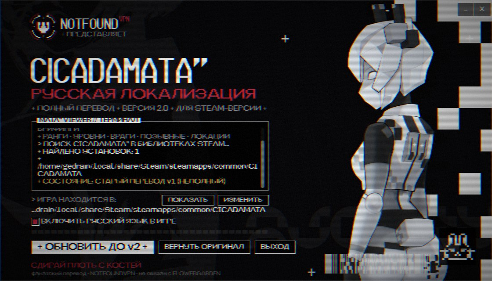
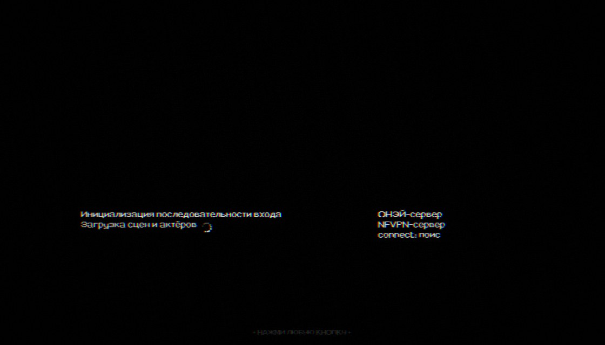
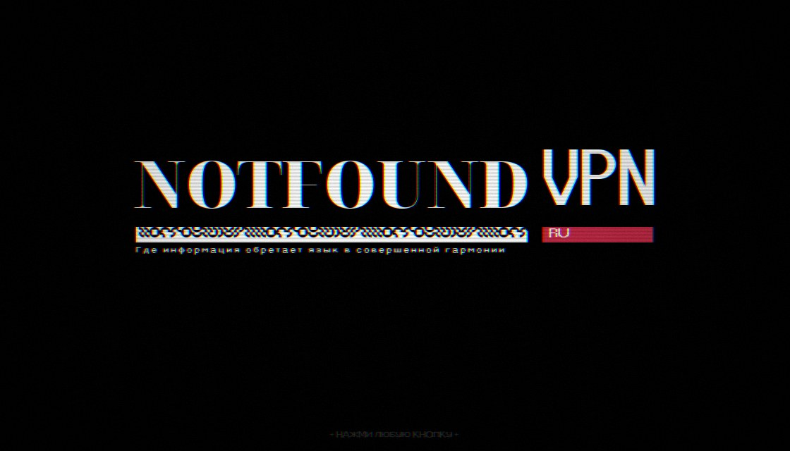
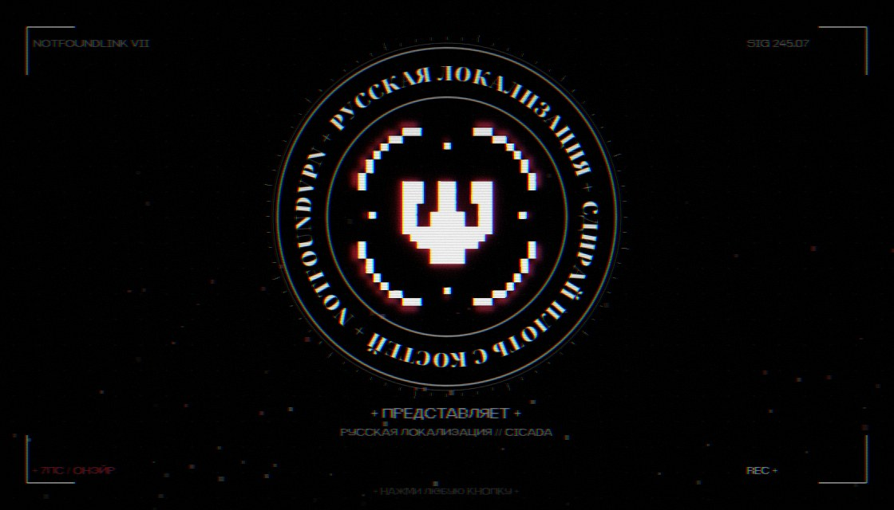

<div align="center">

# CICADAMATA" — русская локализация

**Полный фанатский перевод игры [CICADAMATA"](https://store.steampowered.com/app/3817250/) на русский язык**
от студии **𝐍𝐎𝐓𝐅𝐎𝐔𝐍𝐃ⱽᴾᴺ**

[**⬇ Скачать установщик**](../../releases/latest) · Windows · Linux / Steam Deck (AppImage)



</div>

## Что переведено

Всё, кроме имён персонажей:

- меню, настройки, подсказки, экраны результатов и рейтингов;
- диалоги, субтитры, брифинги, записи терминалов и журналы AEGIS;
- ранги и титулы игрока, названия уровней и глав, враги, события за убийства;
- позывные (*БЕЛЫЙ КРОЛИК, ВЕСТНИК, КРЕМНЕЗЁМ, БЕЗУМНЫЙ ШЛЯПНИК…*), локации (*КАСКАД, СЕНТ-САНВЕЙ, ОНЭЙР, МЮ ЖЕРТВЕННИКА…*);
- режимы: *ЗАБЕГ ПО СФЕРАМ — ОБЫЧНЫЙ / СМЕРТЬЦИКАДЫ / ЭСПЕРИЯ / ЗВЁЗДНЫЙ ВЫСТРЕЛ*.

Кириллица дорисована в родные шрифты игры, поэтому текст выглядит так же, как в оригинале.
Имена (JOYEUSE, FAWN, AUGUST, AEGIS, MARCH…) сохранены. Все решения по терминам — в [глоссарии](translations_src/GLOSSARY.md).

В игре появляется переключатель **НАСТРОЙКИ → ИГРА → ЯЗЫК / LANGUAGE** (РУССКИЙ / ENGLISH, применяется после перезапуска).

## Установка

1. Скачай установщик со страницы [релизов](../../releases/latest):
   - **Windows** — `CICADAMATA_RU_v2.0_Windows.zip`, распакуй и запусти `CICADAMATA_RU_Installer_Windows.exe`
     (SmartScreen: «Подробнее» → «Выполнить в любом случае»);
   - **Linux / Steam Deck** — `CICADAMATA_RU_Installer-x86_64.AppImage`, разреши выполнение и запусти.
2. Установщик сам найдёт игру во всех библиотеках Steam (строка «ИГРА НАХОДИТСЯ В», кнопки «ПОКАЗАТЬ» / «ИЗМЕНИТЬ»).
3. Закрой игру и нажми **«УСТАНОВИТЬ»**.

Удаление — кнопка **«ВЕРНУТЬ ОРИГИНАЛ»** (при установке создаётся копия `CICADAMATA.pck.orig`)
или Steam → Свойства → Установленные файлы → Проверить целостность.

> Перевод привязан к версии игры. Если игра обновилась, установщик откажется ставить перевод — дождись обновления.
> После обновления игры или проверки файлов в Steam перевод пропадает — просто запусти установщик снова.

<div align="center">
  
</div>

## Как это устроено

Игра сделана на Godot 4.7.2. Перевод не трогает исходные файлы, а дописывает в `CICADAMATA.pck`:

- `localization_ru/ru.translation` — каталог Godot для текстов сцен, анимаций, диалогов и настроек;
- `localization_ru/Scripts/**.gdc` — копии скомпилированных скриптов, где заменены только строковые константы
  (токены и идентификаторы проверяются на совпадение); подключаются через translation remaps только для русского языка;
- шрифты `bitpop` и `N4NOOSE` с кириллицей (в шифр-шрифте N4NOOSE кириллица отображается теми же глифами-шифрами);
- `project.binary` с настройками локали и автозагрузкой переключателя языка (`lang_menu.gd`).

При выборе ENGLISH игра работает на оригинальных файлах.

| Папка | Что внутри |
|---|---|
| `translations_src/` | переводы: v1 (`*.json`, `*.py`), правки и новые строки v2 (`v2_revise.py`, `v2_new.py`), глоссарий, шрифт `bitpop_cyr.otf`, `lang_menu.gd` |
| `tools/` | конвейер сборки (`build_all.py`) и CLI-патчер `ru_patch.py` |
| `payload/` | готовые файлы перевода + `manifest.json` (md5 оригинального `.pck`) |
| `installer_src/` | проект установщика на Godot 4.7.2 (Linux AppImage + Windows) |
| `docs/` | README для архива релиза и скриншоты |

### Сборка из исходников

Нужны: лицензионная копия игры, Python 3.14+ с `fonttools` и `pillow`, Godot 4.7.2 (`godot` в `PATH`)
и его шаблоны экспорта (для установщиков).

```sh
python3 tools/build_all.py --pck /путь/к/чистому/CICADAMATA.pck --installers
```

Скрипт распакует игру и декомпилирует её через [GDRE Tools](https://github.com/GDRETools/gdsdecomp) в `work/`,
соберёт данные перевода, пропатчит скрипты, сконвертирует шрифты, соберёт `payload/`,
а с `--installers` — ещё и установщики в `dist/`.

Установить перевод без GUI: `python3 install.py [папка_игры]`, откатить: `./restore.sh [папка_игры]`.

## Отказ от ответственности

Фанатский некоммерческий проект, не связан с FLOWERGARDEN. Игра, её тексты, графика, шрифты и звуки принадлежат
их правообладателям. Для работы перевода нужна купленная копия игры в Steam.

**Сдирай плоть с костей.**
